# `fireflow` benchmarking results

The following are benchmarking results for the `fireflow` library, including
comparisons with existing FCS parsing tools.

This benchmark was created on Aug 28 2026 20:10 (UTC).

## Comparison Results

The following plots compare execution speeds of several FCS libraries for
reading and writing different segments of various FCS files. Not all libraries
support all FCS versions and data layouts; a value will be missing in such
cases.

All bars are the mean of multiple samples. All error bars are 95% confidence
intervals assuming normal sampling distribution.

### *TEXT* Read Speed

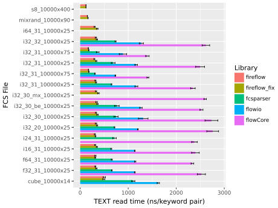

### *TEXT* + *DATA* Read Speed

`flowCore` is many times slower than the other libaries, so it is not shown
here. See [Appendix A](a-text--data-read-speed-with-flowcore) for full plot.

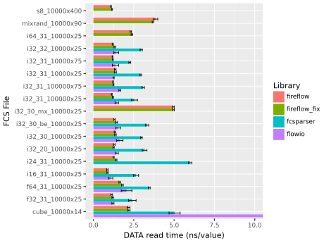

### *TEXT* Write Speed

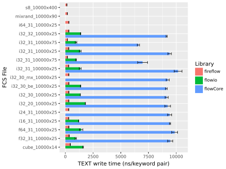

### *TEXT* + *DATA* Write Speed

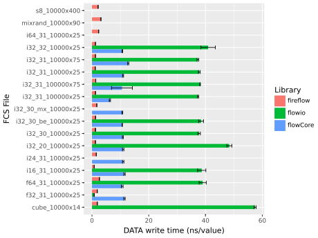

## Fireflow-specific Results

In addition to reading and writing files, `fireflow` can parse all keyword
values in an FCS version-specific manner (standardization), check ranges (not
just bitmask), and compute the CRC.

The other libraries cannot do most of these. Therefore the performance of these
features cannot be compared; however, these are useful for understanding
`fireflow`'s overall performance and may help users understand how it will
perform for their applications.

Each of the following was assessed using `fireflow`'s internal execution
timings. For purposes of uncertainty, these timing were assumed to have such
small error ranges compared to the execution time that their uncertainty was
assumed zero.

### Read Time Composition

This is an overview of how much time `fireflow` spends in each stage of parsing.

Each fill category in the plot represents execution time as follows:

* TEXT: python overhead + HEADER parsing + TEXT parsing
* Std: keyword value parsing and standardization
* DATA: DATA parsing
* Rng: $PnR checking (all values, not just bitmask for integers)
* CRC: CRC computation and checking

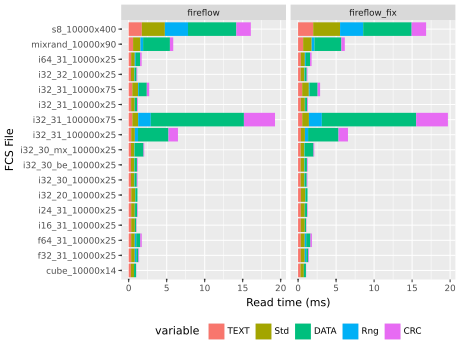

### Standardization Overhead

`fireflow` is the only library that will interpret the entire *TEXT* segment
into an in-memory data structure that allows for database-like manipulation.
This interpretation takes some computational power dependent on the complexity
of *TEXT* and the FCS version.

Overhead in the following plot was computed as the time taken to standardize all
keywords (not including parsing HEADER and parsing TEXT as a flat list)
normalized to the number of keywords.

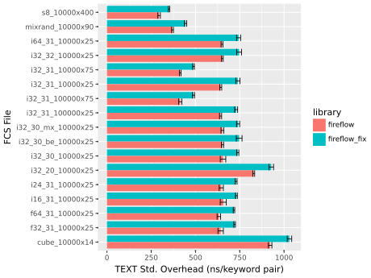

The consequence of standardization can be more clearly seen as a fraction of
reading TEXT and standardizing it (reading HEADER + reading TEXT as flat list +
standardizing TEXT).

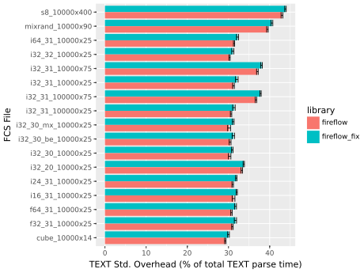

### CRC Overhead

`fireflow` is the only library which can compute the CRC of a dataset and
compare against the checksum at the end. This requires extra computation on top
of reading the segments themselves.

Overhead in the following plot was computed as the time taken to compute/test
the CRC normalized to the total size of the file.

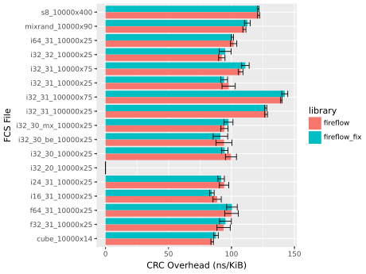

The consequence of this can be more clearly seen by normalizing to total
execution time (reading and standardizing TEXT + reading DATA + checking
ranges + computing CRC).

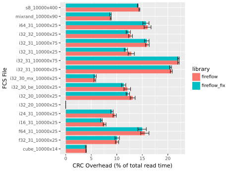

### Range Check Overhead

`fireflow` can check if values are within their designated *$PnR*. This is in
addition to the bitmask check for integer values, which is effectively required
in order to guarantee data integrity.

In general, floats are expected to be harder to compare and thus will be slower.

Overhead in the following plot was computed as the time taken to check ranges
normalized to the number of values in DATA.

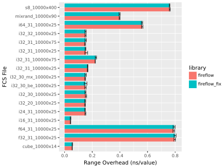

The consequence of this can be more clearly seen by normalizing to total
execution time (reading and standardizing TEXT + reading DATA + checking
ranges + computing CRC).

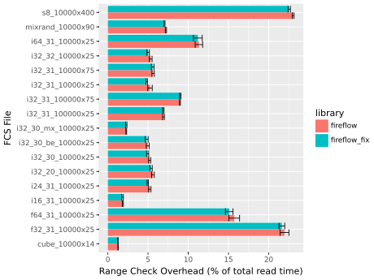

## Methodology

### Test FCS Files

The following files were generated by `fireflow` for testing. Numeric data are
randomly generated within the range of the dataset. Additionally, analogous TSV
files were saved in parallel to each FCS file; these were used to ensure that
each library was reading DATA correctly (see [benchmark equivalence
check](#benchmark-equivalence-check) for more details).

| name | version | n_rows | n_cols | byteord | datatypes | n_keywords | text_nbytes | data_nbytes |
| --- | --- | --- | --- | --- | --- | --- | --- | --- |
| i32_31_10000x25 | FCS3.1 | 10000 | 25 | 1,2,3,4 | U32 | 229 | 2669 | 1000000 |
| i32_31_10000x75 | FCS3.1 | 10000 | 75 | 1,2,3,4 | U32 | 679 | 8096 | 3000000 |
| i32_31_100000x25 | FCS3.1 | 100000 | 25 | 1,2,3,4 | U32 | 229 | 2667 | 10000000 |
| i32_31_100000x75 | FCS3.1 | 100000 | 75 | 1,2,3,4 | U32 | 679 | 8105 | 30000000 |
| i32_20_10000x25 | FCS2.0 | 10000 | 25 | 1,2,3,4 | U32 | 204 | 2230 | 1000000 |
| i32_30_10000x25 | FCS3.0 | 10000 | 25 | 1,2,3,4 | U32 | 204 | 2229 | 1000000 |
| i32_32_10000x25 | FCS3.0 | 10000 | 25 | 1,2,3,4 | U32 | 204 | 2225 | 1000000 |
| i32_30_mx_10000x25 | FCS3.0 | 10000 | 25 | 3,4,1,2 | U32 | 204 | 2226 | 1000000 |
| i32_30_be_10000x25 | FCS3.0 | 10000 | 25 | 4,3,2,1 | U32 | 204 | 2225 | 1000000 |
| i16_31_10000x25 | FCS3.1 | 10000 | 25 | 1,2,3,4 | U16 | 229 | 2542 | 500000 |
| i24_31_10000x25 | FCS3.1 | 10000 | 25 | 1,2,3,4 | U24 | 229 | 2615 | 750000 |
| i64_31_10000x25 | FCS3.1 | 10000 | 25 | 1,2,3,4 | U64 | 229 | 2915 | 2000000 |
| f32_31_10000x25 | FCS3.1 | 10000 | 25 | 1,2,3,4 | F32 | 229 | 2692 | 1000000 |
| f64_31_10000x25 | FCS3.1 | 10000 | 25 | 1,2,3,4 | F64 | 229 | 2691 | 2000000 |
| cube_10000x14 | FCS3.1 | 10000 | 14 | 1,2,3,4 | U08,U16,U32 | 130 | 1404 | 290000 |
| s8_10000x400 | FCS3.2 | 10000 | 400 | 1,2,3,4 | F32,U32 | 4424 | 59158 | 16000000 |
| mixrand_10000x90 | FCS3.2 | 10000 | 90 | 1,2,3,4 | F32,F64,U08,U16,U32,U64 | 1024 | 12572 | 4050000 |

Descriptions of each file and rationale for why it is included in the testing
suite:

* *i32_31_10000x25*: 32-bit unsigned integer data in little-endian in
  FCS3.1. This matches a typical file for instruments that don't use
  floating point data.

* *i32_31_10000x75*: Same as 'i32_31_10000x25' but wider.

* *i32_31_100000x25*: Same as 'i32_31_10000x25' but with more events.

* *i32_31_100000x75*: Same as 'i32_31_10000x25' but wider and with
  more events.

* *i32_20_10000x25*: Same as 'i32_31_10000x25' but in FCS 2.0.

* *i32_30_10000x25*: Same as 'i32_31_10000x25' but in FCS 3.0.

* *i32_32_10000x25*: Same as 'i32_31_10000x25' but in FCS 3.2.

* *i32_30_mx_10000x25*: Same as 'i32_31_10000x25' but with PDP-11 byte
  order and in FCS3.0, which is the latest standard that allows this
  schema to exist.

* *i32_30_be_10000x25*: Same as 'i32_31_10000x25' but with big-endian
  byte order.

* *i16_31_10000x25*: 16-bit unsigned integer data. Some older
  instruments still use this bit width.

* *i24_31_10000x25*: Like 'i32_31_10000x25' but 24-bit. This is much
  rarer than 16-bit files, but some older instruments still use this
  bit width. This is also a good width to test since it isn't a power
  of 2.

* *i64_31_10000x25*: Like 'i32_31_10000x25' but 64-bit. Practically no
  machine uses this width, at least not explicitly. However, some
  machines have Time measurements which are actually 64-bit numbers
  split across 2 columns. There is also nothing stopping anyone from
  writing such a file manually.

* *f32_31_10000x25*: Like 'i32_31_10000x25' but with 32-bit floats.
  This is extremely common.

* *f64_31_10000x25*: Like 'i32_31_10000x25' but with 64-bit floats.
  Practically no machine uses this datatype, but nothing is stopping
  someone from writing a file manually.

* *cube_10000x14*: The Partec CyFlow Cube 6 layout. This is one of a
  few machines that uses mixed integer widths (Stratedigm broadly
  being the other vendor who does this). In this specific case, the
  layout has 12 optical channels at 16-bit, one time channel at
  32-bit, and a doublet mask at 8-bit. The exact machine does not
  matter much; this is simply a representative case to test variable
  bit width parsing.

* *s8_10000x400*: The BD FACSDiscover S8 (or A8) layout. At time of
  writing, this is the only known machine that explicitly produces FCS
  3.2 files. This standard is required because it includes a mix of
  float and integer data (all at 32-bit). `fireflow` also has
  optimizations for mixed data like this that is all the same width
  (it 'cheats' by reading it all as one data type and then casting).
  The exact machine does not matter; this is a representative case
  meant to test this layout.

* *mixrand_10000x90*: An FCS 3.2 file with totally mixed numeric data
  types (not including ASCII). No machine is known to use this format,
  but it is useful for testing purposes since it represents the most
  complex data layout a parser will need to process.

### Libraries

The following libraries were tested:

| Library   | Language    | Read | Write | Version | 
|-----------|-------------|------|-------|---------|
| fireflow  | Rust/Python | X    | X     |   0.1.1 |
| flowio    | Python      | X    | X     |   1.4.0 |
| fcsparser | Python      | X    |       |   0.2.8 |
| flowCore  | R           | X    | X     |  2.22.1 |

Additionally, these libaries can parse the following FCS files types:

| Library   | Mixed ByteOrd | FCS3.2 | 24-bit Int | 64-bit Int | Variable Int |
|-----------|---------------|--------|------------|------------|--------------|
| fireflow  | X             | X      | X          | X          | X            |
| flowio    |               |        |            |            | X            |
| fcsparser |               |        | X          |            | X            |
| flowCore  | X             |        | X          |            |              |

Do to uneven support for some of these features, not all measurements were
collected for all libaries.

### Experimental Setup

The number of trials for each library and metric was the following. The same
number was used across all test FCS files.

| library | read_text_runs | read_data_runs | write_text_runs | write_data_runs |
| --- | --- | --- | --- | --- |
| flowio | 10 | 10 | 10 | 10 |
| flowCore | 3 | 3 | 3 | 3 |
| fcsparser | 10 | 10 | None | None |
| fireflow | 100 | 30 | 100 | 10 |
| fireflow_fix | 100 | 30 | 100 | 10 |

A given experiment consisted of all combinations of test FCS file, library, and
target metric repeated N times as given in the above table. Prior to performing
the experiment, each run (1 repetition each) was executed to ensure all code
paths were hot and that the files were loaded into the page cache. Each run was
then executed *in random order*; randomization should evenly spread any biases
due to code, data, and file caching.

The python garbage collector was run at the start of each `flowio`, `fcsparser`,
and `fireflow` run to eliminate random noise that might be introduced by running
it during execution. The R garbage collector was run analogously in its own
process.

Two benchmark experiments were performed, one comparing `fireflow` to existing
FCS libraries (1-4 in next section), and the other measuring `fireflow`-specific
performance characteristics (5-6 in next section).

### Metrics

Benchmarking performance across FCS libraries was evaluated according to four
main metrics:

1) *TEXT* read speed per keyword pair
2) *TEXT* write speed per keyword pair
3) *DATA* read speed per value 
4) *DATA* write speed per value 

Each of these are relevant for users and readily comparable across libraries
(with the exception of `fcsparser` which does not have write capability). Each
are normalized to the most atomic component of the segment which will scale with
file size.

Overall, (1) and (2) are assessed by reading/writing *HEADER* (assumed
negligable) and *TEXT* without *DATA*. (3) and (4) are assessed by subtracting
the total time from (1) and (2) to the total time required to read/write an
entire file (*HEADER* + *TEXT* + *DATA*).

See next for specifics on how these libraries were invoked.

#### fireflow

(1) was measured by invoking `fcs_read_flat_text` which parses *TEXT* only
without any additional standardization.

(2) was measured by invoking `fcs_read_flat_data` which does the same as (1) and
then interprets the minimal number of keywords necessary to parse *DATA*. This
is the fairest comparison between `fireflow` and the other libraries, which each
do something similar with *TEXT*. CRC calculation was turned off since other
libraries do not check the CRC (`compute_crc="never"`). Range checking was also
turned off except for bitmask checking (`over_range_action="warn"`) which is
comparable to the other libraries.

(3) was measured by first reading an FCS file with `fcs_read_std_text` and then
calling `write_text` on the resulting object.

(4) was measured by first reading an FCS file with `fcs_read_std_dataset` and
then calling `write_dataset` on the resulting object.

#### fireflow_fix

This was identical to running *fireflow* as described in the previous section
except the configuration was created with the scalpal preset. Consult
documentation for details; this will attempt to parse and repair an FCS file on
the fly. Since all FCS files for this benchmark should be perfect, this setting
is actually measuring the overhead to check for deviations from the standard.

#### flowio

(1) was measured by invoking `FlowData` with `only_text=True`. 0

(2) was measured by invoking `FlowData` without any additional options. This is
followed by calling `as_array(preprocess=False)` on the resulting object. This
is to make the comparison more fair for `fireflow` and other libraries which
store the *DATA* segment in 2D. Without this, `flowio` will keep the *DATA*
segment as a 1D array.

(3) was measured by first reading an FCS file similar to (1) and (2) and then
setting the `events` attribute to an empty list (`None` doesn't work) and
calling `write_fcs`.

(4) was measured simiarly to (3) except without zeroing the `events` attribute.

#### fcsparser

`fcsparser` does not have the ability to write FCS files so only read
performance was measured.

(1) was measured by setting `meta_data_only` to `True` in the `parse` function.
(2) was measured similarly to (1) except with `meta_data_only` set to `False`

#### flowCore

(1) was measured by calling `read.FSCheader`.

(2) was measured by calling `read.FCS` with `transformation = FALSE` and
`truncate_max_range = FALSE` to be more comparable with the other libraries
which do not transform their data or check ranges.

(3) was measured by first reading with `read.FCS` and setting the `exprs` slot
to a 1x1 matrix (setting to a matrix with zero rows does not seem to work) and
then calling `write.FCS`. This was assumed to have a negligible impact on write
speed.

(4) was measured by calling `write.FCS` on a flowFrame with events without any
preprocessing as in (3).

### R Subprocess Setup

Measuring `flowCore` required special setup since it required an R subprocess to
be run from within a Python session.

First, the Python parent process creates two named pipes (one for Python->R, one
for the reverse). Next, Python forks an R script asynchronously as a deamon
subprocess. This script runs a single thread which blocks synchronously on a the
Python->R named pipe. Upon receiving input, the R loop will dispact to one of
the test functions. Upon completion, this function will write its output to the
second named pipe. The python parent process blocks on the other end and
continues to the next test after receiving the output. Timing is done with the
`microbenchmark` library in R which should provide the highest precision clock
on the OS with the least amount of overhead.

This setup is necessary since it is desirable to keep caches (CPU, page,
whatever R/flowCore do themselves) warm. The alternative is to fork a subprocess
for each individual test, which will nullify at least some of these caches on
exit. This is the closest analogue to what the Python parent process is doing
itself with the other libraries, while maintaining the ability to run each test
randomly to flatten any temporal biases. Additionally, this makes the entire
benchmark run much faster since R process startup is expensive.

### fireflow-specific Read Timings

`fireflow` has timings built-in so no special flags were passed to enable this.

All timings were obtained by calling `fireflow` with `fcs_read_std_dataset`
which will parse *TEXT* and put it into a standardized data structure before
reading *DATA*. Additionally, `compute_crc="always"` and `over_range_action =
"warn"` were passed to force-enable CRC computation and range checking for all
values. The scalpal preset was used as described above for the `fireflow_fix`
category.

### Benchmark Equivalence Check

In order to ensure each benchmark was actually testing the same thing, the
output dataframe from each library was compared to the source data used to
generate the test FCS files.

In all cases, the dataframe was converted to a `polars.DataFrame` entirely in
64-bit floats since all libraries except `fireflow` return either 32- or 64-bit
float matrices. For `flowCore`, the event matrix was saved to a temporary TSV
file in R and read in python using `polars.read_csv`.

Dataframes were compared using `polars.testing.assert_frame_equal` with default
tolerances for floats.

Note that `fireflow` was used to create the test FCS files. Therefore, this test
with respect to `fireflow` is checking that `fireflow` can read back the exact
same data that it wrote.

The following table shows the check results. `True` indicates the DATA segment
from the given library was equivalent to the source data, taken to be ground
truth. `None` indicates that a library could not parse the given test file due
to its DATA format.

| name | fireflow | fcsparser | flowio | flowCore |
| --- | --- | --- | --- | --- |
| i32_31_10000x25 | True | True | True | True |
| i32_31_10000x75 | True | True | True | True |
| i32_31_100000x25 | True | True | True | True |
| i32_31_100000x75 | True | True | True | True |
| i32_20_10000x25 | True | True | True | True |
| i32_30_10000x25 | True | True | True | True |
| i32_32_10000x25 | True | True | True | True |
| i32_30_mx_10000x25 | True | None | None | True |
| i32_30_be_10000x25 | True | True | True | True |
| i16_31_10000x25 | True | True | True | True |
| i24_31_10000x25 | True | False | None | True |
| i64_31_10000x25 | True | None | None | None |
| f32_31_10000x25 | True | True | True | True |
| f64_31_10000x25 | True | True | True | True |
| cube_10000x14 | True | True | True | None |
| s8_10000x400 | True | None | None | None |
| mixrand_10000x90 | True | None | None | None |

`fcsparser` has a bug which reads little-endian 24-bit files incorrectly.
Specifically, it
[pads](https://github.com/eyurtsev/fcsparser/blob/da70aaa7ec92ff3bd9ce00aec4eea7c77ee8c096/fcsparser/api.py#L101)
zeros onto the front of each field, which for little endian numbers is the least
significant end. This has the effect of multiplying the value by 2^8. This then
gets truncated when the bitmask is applied. The ultimate effect is that numbers
like `0xXX_YY_ZZ` (a hex literal, XX is most significant) end up like
`0xYY_ZZ_00`, assuming $PnR caps the value at 24-bits.

In practice, this combination is extremely rare.

### Environment

* Python Version: 3.12.14 | packaged by conda-forge | (main, Aug 21 2026, 22:48:28) [GCC 14.4.0]
* R Version: 4.5.3 (2026-03-11, x86_64-conda-linux-gnu)
* Linux Kernel: 6.18.46-1-lts

### Package and Build Info

#### fireflow

* Commit Hash: 90465deff1459e747fc89b840f5549031d8cca79
* Build Date: Fri, 28 Aug 2026 18:35:13 +0000
* Rust Compiler Version: rustc 1.97.1 (8bab26f4f 2026-07-14)
* Build Target: x86_64-unknown-linux-gnu
* Build Is Debug: False
* Optimization Level: 3
* Target Features: FXSR, SSE, SSE2

NOTE: extensions only matter for range checks since these are vectorized and
thus will benefit from larger register sizes.

#### numpy

Pertinent for `flowio` and `fcsparser`

* Numpy Version: 1.26.4
* Compilers: gcc-12.3.0 (c), cython-3.0.8 (cython), gcc-12.3.0 (c++)
* Extensions Used: SSE, SSE2, SSE3, SSSE3, SSE41, POPCNT, SSE42, AVX, F16C, FMA3, AVX2

#### flowCore

* Byte Compiled: True
* Compilers: GCC: (conda-forge gcc 14.3.0-17) 14.3.0

#### Others

See [conda environment](../../env.yml) for all exact package versions for
Python and R respectively.

### Hardware

* CPU Model: 13th Gen Intel(R) Core(TM) i7-13800H
* Total Memory (GiB): 62

Note, disk is not reported since read/write for all benchmarks was done in
memory. See [limitations](#limitations).

## Limitations

### In-Memory Access

#### Read benchmarks

The execution times in this benchmark will only reflect a real user's experience
(in an absolute sense) if they access a small number of files repeatedly in a
tight loop. This means that the files are loaded in the page cache which
eliminates disk IO overhead. This will not be the case when many FCS files are
read cold from disk and processed once. For many files, disk access will
bottleneck before parsing (see [Appendix B](b-comparison-to-disk-throughput) for
discussion on this).

This limitation exists because the alternative would require evicting the page
cache before every read. This either requires triggering
`/proc/sys/vm/drop_caches` (requires root, probably not accessible if running on
cloud) or calling `posix_fadvise` (only a suggestion, doesn't guarantee page
clearance).

#### Write benchmarks

All write benchmarks wrote their output files to `/tmp` (the in-memory temporary
folder in Linux). Therefore the interpretation for write performance is
analogous to read performance.

### Repairing FCS Files

This benchmark does not test any imperfect FCS files. However, it does measure
the overhead of checking for FCS standard deviations on perfect FCS files.

In reality, almost all FCS files in the wild will be imperfect. Therefore, the
values of the `fireflow_fix` level in the above results should be taken as a
lower bound on the performance one can expect for real files.

## Appendix

### A. *TEXT* + *DATA* Read Speed (with flowCore)

`flowCore` stores *DATA* internally as a 64-bit float matrix. This is due to R
only having 64-bit floats and 32-bit signed integers. Given this, it makes sense
why the fastest `flowCore` run is a file with entirely 64-bit floats; no data
needs to be copied into an R-native matrix. Even so, this is still much slower
than other libraries for this same data schema. Others are much worse.

Note that 64-bit FCS files (in any type) are very rare, if not non-existent.

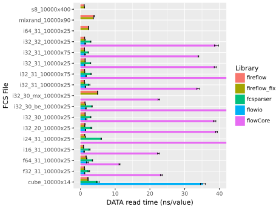

### B. Comparison to Disk Throughput

Files in these benchmark experiments should be read from a hot page cache, not
from disk. Reading a file from a real disk will inflate the execution times
upward non-trivially.

The following plots show the *DATA* parsing throughput of `fireflow` in ns/KiB
(note, this isn't something more familiar like GiB/s because getting the
uncertainty of a reciprocal random variable is relatively difficult). Only
`fireflow` is shown because all other libraries should be a similar speed or
slower. *TEXT* is not shown because *DATA* will dominate in terms of total bytes
transferred.

Lines on the plots represent the following IO speeds for reference.

* red: DDR5 memory speed, assumed to be 20 GiB/s for read and write
* green: NVMe PCIe 3.0 speed, assumed to be 3.5 and
  2 GiB/s for read and write respectively
* blue: SATA SSD speed, assumed to be 0.5 GiB/s for read and write

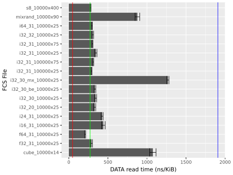
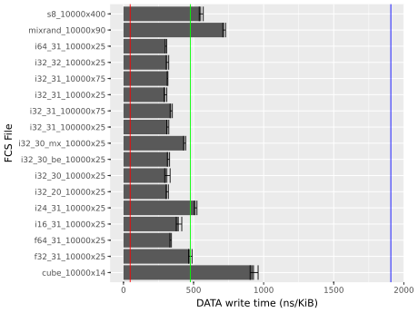